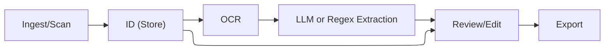

# acceptarium

> BRAINSTORM STAGE

acceptarium
:   (*Latin*) allotment-holding
:   (*Medieval*) receipt book

CLI tooling to facilitate scanning receipts, extracting useful data, archiving the assets, and importing the results into [Plain Text Accounting][pta] systems.

----

## Overview

1. Scan or import scanned receipts, individually or via some bulk mechanism.
1. Archive scanned assets using [Git Annex][gitannex] (or potentially pluggable backends? LFS? WebDAV?).
1. **Optionally** extract data via OCR using local LLM tooling ([Ollama][ollama] or pluggable remote tooling).
1. **Optionally** automatically process data into structured transaction info (via LLM tooling or patten matching).
1. Facilitate either review of the data with a chance to edit (for automatically extracted data) or manual entry.
1. Export extracted data as transaction(s) via CVS (or possibly directly to journal for [HLedger][hledger], [Ledger CLI][ledgercli], [Beancount][beancount], etc.).

# Goals

* Automate as many steps as possible to make it easy to handle receipts, invoices, etc. in bulk.
* Use only local first privacy preserving tooling by default even where LLMs may be involved.
* Facilitate human review and approval or editing for any non-deterministic steps like meta-data extraction from OCR.
* Allow re-processing data from initial assets in the event of improved tooling (better OCR, more journal import rules, etc.).

## Non-goals

* Avoid lock-in to any particular PTA solution (pair with [HLedger][hledger], [Ledger CLI][ledgercli], [Beancount][beancount], or similar journal tools)

## Dependencies

* [Git Annex][gitannex]

[beancount]: https://beancount.io/
[gitannex]: https://git-annex.branchable.com/
[hledger]: https://hledger.org/
[ledgercli]: https://ledger-cli.org/
[ollama]: https://ollama.com/
[pta]: https://plaintextaccounting.org/
